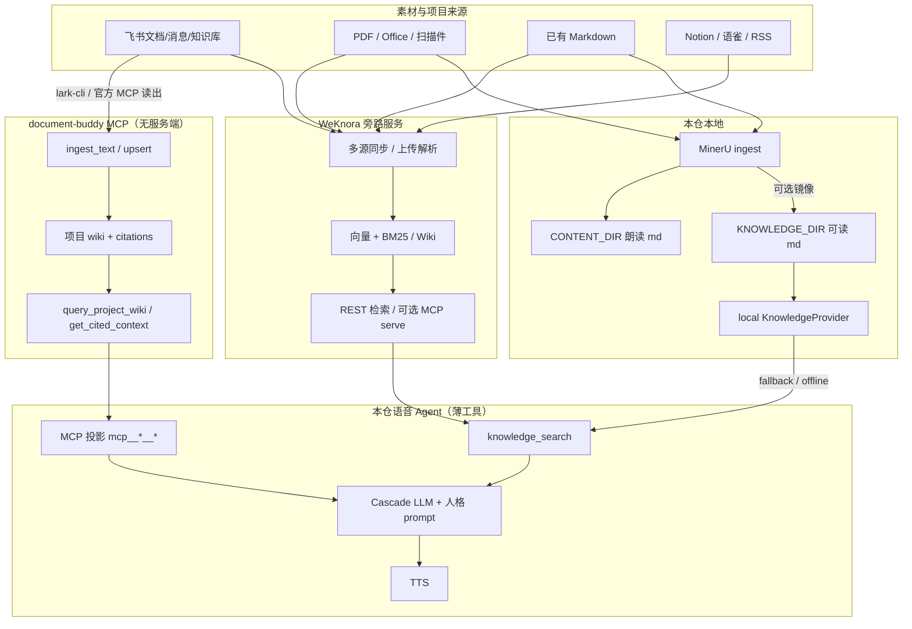

# 知识库增强：WeKnora + document-buddy 组合设计

日期：2026-08-05  
定位：智能 + 陪伴 + 个性 + **懂你**（素材检索与项目记忆纪律）  
约束：在 upstream 上做**加法**；RAG 是 Agent 侧能力，**不做 WebUI 知识 CMS**。

参考：

1. [WeKnora](https://github.com/Tencent/WeKnora) / [README_CN](https://github.com/Tencent/WeKnora/blob/main/README_CN.md) — 企业知识中台（RAG + Agent + Wiki，REST / API Key / MCP / CLI，Docker 私有化）
2. [document-buddy](https://github.com/Hanzhi0807/document-buddy) — 飞书向无服务端 MCP（ingest → 项目 wiki；强制带 citations；不存飞书 token / LLM key）

本仓既有：

- `KNOWLEDGE_DIR` 只认 `.md`，工具 `knowledge_search`（`KNOWLEDGE_PROVIDER=local|none`）
- 大文件 ingest：MinerU → Markdown（`docs/content-ingest-rag.md`，`server/src/voice/reader/ingest/`）
- CapabilityRegistry + MCP 投影（`MCP_SERVERS_JSON` / `capabilities/mcp/*.json` → `mcp__<server>__<tool>`）

---

## 1. 目标

- 语音 Agent 能答两类问题，且不把本仓做成知识 CMS：
  1. **素材库问答**：PDF / MD / 多源同步后的长文档（设定、手册、书稿镜像等）
  2. **项目记忆问答**：飞书工作流沉淀的「需求 / 决策 / 风险 / 承诺」，**必须带 citation，无证据不编**
- 在现有薄工具面上接线：保留语音体验与 MD-first 可读性；外部重能力放旁路服务 / MCP。
- 工程上可开关、可降级：未装 WeKnora / 未配 document-buddy 时，行为与现网 `local` knowledge 一致。

## 2. 非目标

- 本仓 WebUI 嵌入 WeKnora 管理台或 document-buddy 管理面
- 自研企业级向量库 / GraphRAG / 飞书全量同步引擎
- 用 WeKnora Agent/ReAct 替换本仓 cascade LLM 主循环
- 把飞书 token、WeKnora 平台密钥、LLM key 写进本仓业务代码或提交到 git
- 本设计阶段启动 Docker / 安装 WeKnora（仅文档；实现期 PoC 再装）
- 改写 `realtime-gateway` / cascade session / StreamCore 等 upstream 大文件主路径
- 把 episode 情节记忆与知识库混为一谈（情节仍见 `2026-08-05-episode-memory-design.md`）

---

## 3. 角色分工

| 组件 | 角色 | 本仓怎么用 |
|------|------|------------|
| **WeKnora** | 素材/检索中台（旁路服务） | 飞书/Notion/语雀同步、PDF 等多格式入库、混合检索、可选 Wiki；本仓只调 **检索 API**（或白名单 MCP），不嵌其 UI |
| **document-buddy** | 飞书项目记忆 + 防幻觉纪律（MCP） | 飞书读入 → ingest → 项目 wiki；语音侧只投影 `query_project_wiki` / `get_cited_context`（及必要的 list/review）；**禁止**无 citation 编造 |
| **本仓 local knowledge** | MD-first 可读备份 + 离线兜底 | `KNOWLEDGE_DIR/**/*.md`；MinerU/导入镜像；无 WeKnora 时仍可用 |
| **MinerU ingest** | 大文件 → Markdown 解析缝 | 继续服务 `CONTENT_DIR` 朗读 + 可选扁平镜像到 `KNOWLEDGE_DIR`；**不**替代 WeKnora 企业入库 |

边界一句话：

- WeKnora = 「材料从哪来、怎么检」
- document-buddy = 「项目事实以 wiki 证据为准」
- 本仓语音 = 「薄工具调用 + 陪伴人格」
- MinerU = 「个人机大文件进 MD 管道」

---

## 4. 推荐方案与取舍

### 推荐：**检索走 WeKnora，本地 md 作可读备份（MD-first 镜像）**

```text
权威检索（online）     可读备份 / 离线兜底
─────────────────     ────────────────────
WeKnora API search  →  语音 knowledge_search
可选 export/镜像 .md →  KNOWLEDGE_DIR（人工可读、git/备份友好）
```

| 方案 | 说明 | 取舍 |
|------|------|------|
| **A. 推荐：WeKnora 检索 + 本地 md 镜像** | `KNOWLEDGE_PROVIDER=weknora` 实现同一 `KnowledgeProvider` 契约；成功路径走远端检索；失败或 `WEKNORA_FALLBACK_LOCAL=1` 回落 local；重要语料仍可 `content:import --index-knowledge` 或周期性导出 md 到 `KNOWLEDGE_DIR` | 语音工具面不变；双库可能短暂不一致（见风险）；运维有 WeKnora 重量 |
| B. 仅 MCP 投影 WeKnora | 不扩展 provider，全靠 `mcp__weknora__*` | 零 provider 代码，但模型要选对 MCP 工具名；延迟与超时更碎；与现网 `knowledge_search` 双入口易混 |
| C. 仅增强 local | 继续 BM25/词面分块 | 无多源同步与 dense 检索；不符合「组合参考」诉求 |

document-buddy **不**并进 `KnowledgeProvider`：它是项目 wiki 纪律层，走 **MCP 投影**；与素材检索并列，由 prompt / skill 约束「项目问题先查 wiki」。

P0 可先只做 **WeKnora HTTP 旁路 PoC**（甚至 curl 级），P1 再挂 document-buddy MCP + prompt 纪律。

---

## 5. 架构图



语音侧不出现两套管理台：WeKnora / 飞书 wiki 的管理仍在各自原生界面完成。

---

## 6. 语音侧工具边界

| 工具 / 能力 | 决策 | 说明 |
|-------------|------|------|
| `knowledge_search` | **保留并增强背后 provider** | 对模型保持单一素材检索入口；`local` 不变；新增 `weknora`（及可选 hybrid） |
| `KNOWLEDGE_PROVIDER` | 扩展枚举 | 现有 `local \| none` → 加 `weknora`（实现期）；hybrid 若需要再开 `weknora+local` |
| document-buddy | **MCP 投影，不进 KnowledgeProvider** | 白名单：`query_project_wiki`、`get_cited_context`；可选 `list_review_items`；默认不投影 `ingest_*` / `resolve_conflict`（写入类另开 allow 或后台 Agent） |
| WeKnora MCP | **可选，非 P0 主路径** | P0 优先 REST 适配进 `knowledge_search`；MCP 作管理/高级工具备用 |
| HTTP `/api/knowledge*` | 保留薄运维缝 | 继续 list/search/reindex；weknora 模式下 reindex 语义变为「触发远端/健康探测」，不做本仓 CMS |
| WebUI | **不嵌入** | 最多状态灯（health：weknora reachable / mcp projected）；无文档上传 CMS |

Prompt / Skill 纪律（加法，非协议破坏）：

- 素材/设定/手册类 → `knowledge_search`
- 项目进度/客户承诺/冲突类 → 先 `mcp__document_buddy__query_project_wiki`（或投影短名），**无 citations 则明确说没有证据**
- 与 episode「懂你」互补：情节是个人互动事实；wiki 是项目证据；互不替代

---

## 7. 数据流：飞书 / PDF / MD → 语音问答

### 7.1 素材库（WeKnora 主路径）

```text
飞书/Notion/语雀/PDF/MD
        │
        ▼
 WeKnora（同步或上传 → 解析 → 索引）     ← 管理在 WeKnora UI/CLI
        │
        ▼
 REST hybrid search（API Key，按 KB 限域）
        │
        ▼
 本仓 weknora KnowledgeProvider.search
        │
        ▼
 knowledge_search → Cascade LLM → TTS
        │
        └─►（可选）导出/镜像 .md → KNOWLEDGE_DIR 可读备份
```

### 7.2 个人机大文件朗读（现有 MinerU，不变）

```text
PDF/DOCX → MinerU → CONTENT_DIR（content_control）
                  └─可选→ KNOWLEDGE_DIR（local knowledge_search）
```

与 WeKnora 并行：同一本书可只进朗读、只进 WeKnora、或两端都有（需接受双份维护，见风险）。

### 7.3 飞书项目记忆（document-buddy）

```text
飞书原文（由 lark-cli / 官方 MCP 读出，本仓不存 token）
        │
        ▼
 document-buddy ingest_text → 本地 wiki 状态（WORK_MEMORY_DATA_DIR）
        │
        ├─► 可选 sync_to_feishu → 飞书可见 wiki
        └─► query_project_wiki / get_cited_context
                    │
                    ▼
         MCP 投影 → 语音 LLM（强制 citations）
```

语音会话默认**只读查询**；ingest 放在桌面 Agent / 脚本侧，避免语音误写。

---

## 8. 加法接线缝（实现期指引；本文不改代码）

### 8.1 建议新增 / 薄改

| 缝 | 动作 |
|----|------|
| `server/src/knowledge/weknora-provider.mjs` | **新建**：实现 `ingest/search/listSources/health`，HTTP 调 WeKnora |
| `server/src/knowledge/resolve.mjs` + `provider.mjs` | 薄：注册 `weknora` kind |
| `server/src/core/config.mjs` / `.env.example` / `docs/configuration.md` | 环境变量：`WEKNORA_BASE_URL`、`WEKNORA_API_KEY`、`WEKNORA_KB_IDS`、`WEKNORA_TIMEOUT_MS`、`WEKNORA_FALLBACK_LOCAL` |
| `capabilities/mcp/*.json` 或 `MCP_SERVERS_JSON` | document-buddy stdio 白名单（只读查询工具） |
| `config/frontend-agent/PROMPT.md` | 短纪律：项目问题先 wiki；素材走 knowledge_search |
| `server/test/weknora-provider.test.mjs` 等 | 契约单测（mock fetch） |
| `examples/knowledge/`（可选） | 旁路 curl / smoke 脚本 |

`bootstrap.mjs`：已有 `resolveKnowledgeProvider` + `resolveCapabilityRegistry`；理想情况**只随 config 生效，无额外大改**。  
`capability-routes.mjs`：继续吃 `knowledgeStore` 契约即可。

### 8.2 明确不碰的 upstream 大文件 / 主路径

- `server/src/voice/realtime-gateway.mjs`（除已有 tools/DI 注入点外不做知识逻辑）
- `server/src/voice/cascade/**` session 主循环
- `server/src/voice/tools/tool-call-handler.mjs` 大段重写（`knowledge_search` 已有分支则保持）
- WebUI 知识 CMS / 双管理台嵌入
- 自改 WeKnora / document-buddy 上游源码（以配置与适配层对接）

---

## 9. PoC 里程碑与验收

### P0 — 旁路可独立验证（不绑语音 UI）

1. **WeKnora 旁路 smoke（实现期才装服务；设计阶段只定验收）**
   - 健康：`GET {WEKNORA_BASE_URL}/health`（或官方等价）→ 200
   - 检索：用 scoped API Key 对测试 KB `POST` 检索 → 命中含 source / snippet
   - 本仓适配（实现后）：`KNOWLEDGE_PROVIDER=weknora` 下 `POST /api/knowledge/search` 与工具契约一致
2. **降级**：WeKnora 宕机时 `health().ok=false`；若开 fallback → local md 仍可搜
3. **不回归**：`KNOWLEDGE_PROVIDER=local` 现有测试全绿

验收标准（P0）：

- [ ] 不启动本仓 WebUI 也能用 curl/脚本验证检索
- [ ] 语音工具名仍为 `knowledge_search`（模型无需知 WeKnora）
- [ ] 密钥仅环境变量；文档与示例无真实 secret
- [ ] 未配置 WeKnora 时默认行为与现网一致

### P1 — document-buddy 纪律 + 语音联调

1. MCP 白名单投影查询工具；危险/写入工具默认不进前台
2. Prompt：项目问题无 citations → 明确「没有证据」
3. 手验：素材问 `knowledge_search`；项目问 wiki MCP；两者不互相污染
4. （可选）MinerU 镜像与 WeKnora 入库职责写进运维 runbook，避免双写混乱

验收标准（P1）：

- [ ] `GET /api/capabilities` 可见 document-buddy 投影工具
- [ ] 无证据问题时模型不编造（抽测 ≥3 轮）
- [ ] 端到端语音一轮素材问答 + 一轮项目问答延迟可接受（见风险：目标 P95 工具往返 < 2.5s 个人机局域网）

---

## 10. 风险

| 风险 | 影响 | 缓解 |
|------|------|------|
| **运维重量** | WeKnora Docker（DB/向量/队列）远重于本仓 Gateway | 可选依赖；默认 local；文档标明「个人机可只跑 document-buddy + local」 |
| **双库不一致** | WeKnora 已更新、本地 md 未镜像（或相反） | 约定：online 以 WeKnora 为准；md 仅备份；fallback 时提示可能过期 |
| **延迟** | 语音轮次多一次 HTTP/MCP | 严超时（≤ `MCP_TOOL_TIMEOUT_MS` / `WEKNORA_TIMEOUT_MS`）；截断 snippet；禁止语音路径跑 WeKnora 全 Agent ReAct |
| **密钥** | API Key / 飞书授权泄露 | WeKnora Key 只放 env；document-buddy 不存飞书 token；MCP `env` 不进 git；不在 WebUI 展示完整 Key |
| **工具爆炸** | MCP 投影过多干扰陪伴对话 | 严格 whitelist；写入类不进语音前台 |
| **职责混淆** | 模型把项目问题扔给 knowledge_search | Prompt + 少量 skill 说明；后续可加 router 启发式（非 P0） |

---

## 11. 与现有记忆形态的关系

| 形态 | 用途 |
|------|------|
| local / openviking / evermind / mem0 | 用户长期记忆（人） |
| episode | 跨会话情节粗记（互动事实） |
| local knowledge / WeKnora | 固定语料 RAG（材料） |
| document-buddy | 项目 wiki 证据（团队事实 + citation） |

「懂你」= episode + 用户记忆；「懂材料/懂项目」= knowledge + document-buddy。不要把 wiki 证据写进 episode，也不要把私人情节塞进 WeKnora 公共 KB（除非用户明确同步）。

---

## 12. 未决问题

1. WeKnora 检索 API 的稳定路径与响应字段（官方 `/api/...` 与 ClawHub Skill 封装可能演进）——实现前用一次真实 OpenAPI 对齐。
2. 是否在 P1 引入 `KNOWLEDGE_PROVIDER=hybrid`（weknora 与 local 并行 merge），还是仅 fallback。
3. document-buddy 在语音前台是否允许只读以外的 `list_review_items`（冲突提醒 vs 干扰陪伴）。
